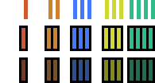
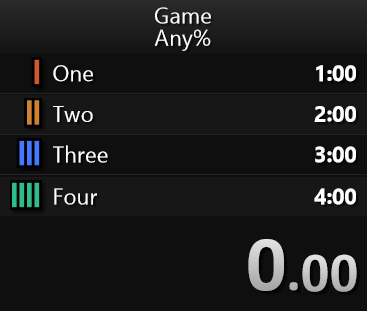

Split icons
===========

These images can be used as split icons for a speedrun timer.

The ones included in this repository are bar icons used to grade the "quality"
of a split. For example, one bar would indicate there is a lot of time to save
on a particular split and four bars would mean very little time to save. You
can see at a glance the good and bad parts of a run.

